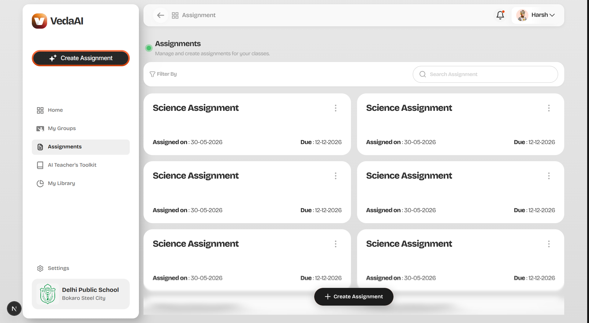

# **VedaAI – Full Stack Engineering Assignment**



## **Overview**
An AI-powered Assessment Creator that enables teachers to effortlessly generate well-structured, multi-section question papers. Built strictly according to the provided high-fidelity Figma designs, this platform leverages advanced AI to dynamically construct tailored assignments.

## 🌟 **Core Features Implemented**

### **1. Assignment Creation (Frontend)**
- **Pixel-Perfect Implementation**: Meticulously matched Figma layouts, typography, padding, and responsive constraints.
- **Dynamic Form System**: Allows configuring due dates, number of questions, question types, and detailed instruction prompts.
- **Robust Validation**: Strict form validation ensures negative values, duplicate question types, or empty mandatory fields are not submitted.
- **State Management**: Implemented using **Zustand** for lightweight, scalable global state handling across the multi-step flow.

### **2. AI Question Generation & Real-time Sync**
- **Prompt Engineering**: Raw form inputs are converted into highly structured prompts for the LLM.
- **Structured JSON Output**: The AI reliably generates correctly categorized data (Sections, Question Text, Difficulty Tags, and Marks allocation). No raw LLM response is ever rendered.
- **Real-Time WebSockets**: Using `Socket.io`, the frontend listens for real-time progress updates while the backend processes the generation asynchronously, ensuring a highly responsive UX.

### **3. Scalable Backend Architecture**
- **MongoDB**: Used for persistent storage of Assignment configurations and the finalized generated JSON payloads.
- **BullMQ + Redis**: Engineered a resilient background job queue system. When an API request is received, a job is added to the queue, and a dedicated worker securely processes the AI generation. This decouples long-running AI requests from HTTP requests, preventing timeouts.
- **WebSocket Gateway**: Dedicated socket events notify the client upon successful generation or error states.

### **4. Enhanced Output Page**
- **High-Fidelity Presentation**: The generated JSON is mapped into a beautifully structured, exam-style UI (complete with Student Info headers and Section breakdowns).
- **PDF Export**: Integrated a seamless "Download as PDF" feature that isolates the paper component and prints it securely via an internal `iframe` for perfectly formatted A4 extraction.
- **Visual Hierarchy**: Clean typography, distinct difficulty badges, and proper spacing ensure the output is instantly usable for teachers.
- **Mobile Responsive**: Implemented a fluid layout strategy, ensuring the desktop sidebar gracefully collapses and the grid systems adapt flawlessly for tablet/mobile viewports.

---

## 🛠️ **Technology Stack**

### **Frontend:**
- Next.js (App Router) + TypeScript
- Zustand (Global State)
- Socket.io-client (WebSockets)

### **Backend:**
- Node.js + Express + TypeScript
- MongoDB + Mongoose (Database)
- Redis (Caching & Job Queue State)
- BullMQ (Background Job Queue Processing)
- Socket.io (Real-time events)

### **AI / LLM:**
- Cerebras API configured for rapid, strict JSON extraction and prompt structuring.

---

## 🚀 **Setup & Installation Instructions**

### **Prerequisites**
- Node.js (v18+)
- Redis Server (Running locally or via Docker)
- MongoDB instance (Local or Atlas URI)

### **Backend Setup (`api-server`)**
1. Navigate to the backend directory:
   ```bash
   cd apps/api-server
   ```
2. Install dependencies:
   ```bash
   npm install
   ```
3. Set up environment variables (`.env`):
   ```env
   PORT=5000
   MONGODB_URI=your_mongodb_connection_string
   REDIS_URL=your_redis_connection_url
   CEREBRAS_API_KEY=your_cerebras_api_key
   FRONTEND_URL=http://localhost:3000
   ```
4. Start the server (which automatically boots up the BullMQ worker):
   ```bash
   npm run dev
   ```

### **Frontend Setup (`web-app`)**
1. Navigate to the frontend directory:
   ```bash
   cd apps/web-app
   ```
2. Install dependencies:
   ```bash
   npm install
   ```
3. Set up environment variables (`.env.local`):
   ```env
   NEXT_PUBLIC_API_URL=http://localhost:5000
   NEXT_PUBLIC_SOCKET_URL=http://localhost:5000
   # (Include Clerk keys if authentication is being utilized)
   ```
4. Start the Next.js development server:
   ```bash
   npm run dev
   ```

---

## 🎯 **Architectural Approach & Highlights**
- **Decoupled Job Queue**: By utilizing **BullMQ** with **Redis**, the system is built to handle heavy, concurrent AI generation requests without locking up the Node.js event loop or timing out frontend API calls.
- **Predictable AI Parsing**: The prompt sent to the LLM explicitly enforces a rigid JSON schema, which allows the frontend to confidently render complex nested sections (Sections -> Questions -> Marks/Difficulty) without worrying about hallucinated formatting.
- **Non-Invasive PDF Generation**: Instead of relying on heavy headless browser libraries (like Puppeteer) on the backend for PDF generation, the system uses a highly optimized frontend `window.print` injection technique via hidden iframes. This ensures the frontend UI scales perfectly to A4 dimensions with zero extra server cost.
